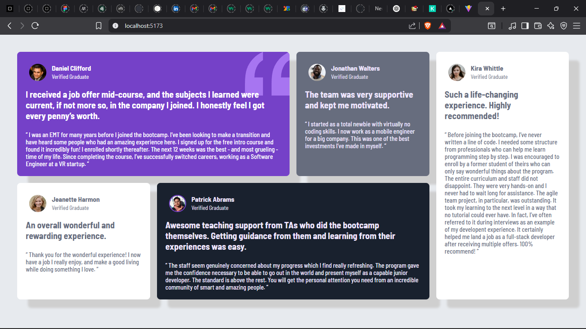

# Frontend Mentor - Testimonial grid section solution

This is a solution to the [Testimonial Grid Section challenge on Frontend Mentor](https://www.frontendmentor.io/challenges/four-card-feature-section-weK1eFYK). Frontend Mentor challenges help you improve your coding skills by building realistic projects.

## Table of contents

- [Overview](#overview)
  - [The challenge](#the-challenge)
  - [Screenshot](#screenshot)
  - [Links](#links)
- [My process](#my-process)
  - [Built with](#built-with)
  - [What I learned](#what-i-learned)
  - [Continued development](#continued-development)
  - [Useful resources](#useful-resources)
- [Author](#author)
- [Acknowledgments](#acknowledgments)

## Overview

### The challenge

Users should be able to:

- View the optimal layout for the site depending on their device's screen size

### Screenshot



### Links

- Solution URL: [Click here](https://github.com/thatladtemod/Testimonial-Grid)
- Live Site URL: [Click here](http://testimonial-grid-liart.vercel.app/)

## My process

### Built with

- Semantic HTML5 markup
- CSS custom properties
- Flexbox
- CSS Grid
- Mobile-first workflow
- [React](https://reactjs.org/)

### What I learned

This project helped me understand how to combine CSS Grid and Flexbox for responsive layouts. I learned how to use `grid-template-areas` for complex layouts and how to center items both vertically and horizontally within a grid. I also practiced structuring a React project with reusable components.

**Example: Centering cards in a CSS Grid**
```css
.grid-container {
    display: grid;
    grid-template-columns: repeat(4, 1fr);
    grid-template-areas: 
      "one one two five"
      "three four four five";
  }
```

### Continued development

I plan to continue improving my skills with advanced CSS Grid layouts and responsive design. I also want to focus more on accessibility and semantic HTML in future projects.

### Useful resources

- [CSS-Tricks: A Complete Guide to Grid](https://css-tricks.com/snippets/css/complete-guide-grid/) - Helped me understand grid-template-areas and alignment.
- [MDN Web Docs: CSS Grid Layout](https://developer.mozilla.org/en-US/docs/Web/CSS/CSS_Grid_Layout) - Reference for all grid properties and best practices.

## Author

- Frontend Mentor - [@thatladtemod](https://www.frontendmentor.io/profile/thatladtemod)

## Acknowledgments

Thanks to the Frontend Mentor community for feedback and inspiration!